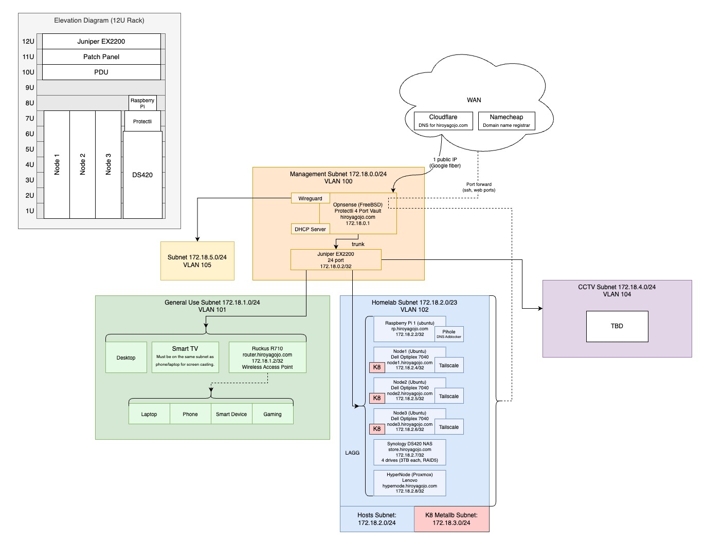

# HG Homelab

Homelab configurations and setup using Ansible, Kubernetes, Vault, and more.

Export drawio:
```
drawio --export homelab.drawio -b 25 --format jpg
```

## Ansible

Note: Ansible's vault lookup requires the env `OBJC_DISABLE_INITIALIZE_FORK_SAFETY=YES` to be set.



Install requirements:
```
ansible-galaxy collection install -r collections.yaml
```

Run a playbook:
```
ansible-playbook -i hosts.ini playbooks/software.yaml --tags pihole
```
